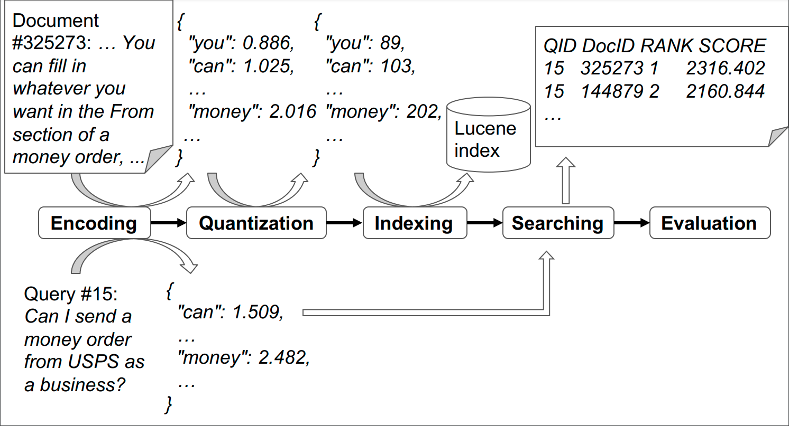

<h1 align="center">

</h1>

<p align="center">
    <a href="https://github.com/thakur-nandan/sprint/releases">
        
    </a>
    <a href="https://www.python.org/">
            
    </a>
    <a href="https://github.com/thakur-nandan/sprint/blob/master/LICENSE">
        
    </a>
    <!-- <a href="https://colab.research.google.com/drive/1HfutiEhHMJLXiWGT8pcipxT5L2TpYEdt?usp=sharing">
        
    </a> -->
    <a href="https://pepy.tech/project/sprint-toolkit">
        
    </a>
    <a href="https://github.com/thakur-nandan/sprint/">
        
    </a>
</p>

<h3 align="center">
    <a href="https://uwaterloo.ca"></a>
    <a href="http://www.ukp.tu-darmstadt.de"></a>
    <a href="https://www.tu-darmstadt.de/"></a>
</h3>

### SPRINT provides a _unified_ repository to easily _evaluate_ diverse state-of-the-art neural (BERT-based) sparse-retrieval models.

SPRINT toolkit allows you to easily search or evaluate any neural sparse retriever across **any** dataset in the BEIR benchmark (or your own dataset). The toolkit provides evaluation of seven diverse (neural) sparse retrieval models: [SPLADEv2](https://arxiv.org/abs/2109.10086), [BT-SPLADE-L](https://arxiv.org/abs/2207.03834), [uniCOIL](https://arxiv.org/abs/2106.14807), [TILDEv2](https://arxiv.org/abs/2108.08513), [DeepImpact](https://arxiv.org/abs/2104.12016), [DocT5query](https://cs.uwaterloo.ca/~jimmylin/publications/Nogueira_Lin_2019_docTTTTTquery-v2.pdf) and [SPARTA](https://aclanthology.org/2021.naacl-main.47/).

SPRINT Toolkit is built around as a useful wrapper around Pyserini. It performs inference a five-step sequential pipeline unifying all sparse retrieval evaluation. The process is illustrated in the figure below:

<h3 align="center">
   
</h3>

If you want to learn and read more about the SPRINT toolkit, please refer to our paper for more details:

* [**SPRINT: A Unified Toolkit for Evaluating and Demystifying Zero-shot Neural Sparse Retrieval**]() (Accepted at SIGIR'23 Resource Track)

## :runner: Getting Started
SPRINT is backed by Pyserini which relies on Java. To make the installation eaiser, we recommend to follow the steps below via `conda`:

```bash
#### Create a new conda environment using conda ####
$ conda create -n sprint_env python=3.8
$ conda activate sprint_env

# Install JDK 11 via conda
$ conda install -c conda-forge openjdk=11

# Install SPRINT toolkit using PyPI
$ pip install sprint-toolkit
```

## :runner: Quickstart with SPRINT Toolkit

### Quick start
For a quick start, we can go to the [example](examples/inference/distilsplade_max/beir_scifact/all_in_one.sh) for evaluating SPLADE (`distilsplade_max`) on the BeIR/SciFact dataset:
```bash
cd examples/inference/distilsplade_max/beir_scifact
bash all_in_one.sh
```
This will go over the whole pipeline and give the final evaluation results in `beir_scifact-distilsplade_max-quantized/evaluation/metrics.json`:

<details>
  <summary>Results: distilsplade_max on BeIR/SciFact</summary>
  
  ```bash
     cat beir_scifact-distilsplade_max-quantized/evaluation/metrics.json 
     # {
     #     "nDCG": {
     #         "NDCG@1": 0.60333,
     #         "NDCG@3": 0.65969,
     #         "NDCG@5": 0.67204,
     #         "NDCG@10": 0.6925,
     #         "NDCG@100": 0.7202,
     #         "NDCG@1000": 0.72753
     #     },
     #     "MAP": {
     #         "MAP@1": 0.57217,
     #     ...
     # }
  ```
</details>

Or if you like running python directly, just run the code snippet below for evaluating `castorini/unicoil-noexp-msmarco-passage` on `BeIR/SciFact`:
```python
from sprint.inference import aio


if __name__ == '__main__':  # aio.run can only be called within __main__
    aio.run(
        encoder_name='unicoil',
        ckpt_name='castorini/unicoil-noexp-msmarco-passage',
        data_name='beir/scifact',
        gpus=[0, 1],
        output_dir='beir_scifact-unicoil_noexp',
        do_quantization=True,
        quantization_method='range-nbits',  # So the doc term weights will be quantized by `(term_weights / 5) * (2 ** 8)`
        original_score_range=5,
        quantization_nbits=8,
        original_query_format='beir',
        topic_split='test'
    )
    # You would get "NDCG@10": 0.68563
```
### Step by step
One can also run the above process in 6 separate steps under the [step_by_step](examples/inference/distilsplade_max/beir_scifact/step_by_step) folder:
1. [encode](examples/inference/distilsplade_max/beir_scifact/step_by_step/1.encode.beir_scifact-distilsplade_max-float.sh): Encode documents into term weights by multiprocessing on mutliple GPUs;
2. [quantize](examples/inference/distilsplade_max/beir_scifact/step_by_step/2.quantize.beir_scifact-distilsplade_max-2digits.sh): Quantize the document term weights into integers (can be scaped);
3. [index](examples/inference/distilsplade_max/beir_scifact/step_by_step/3.index.beir_scifact-distilsplade_max-2digits.sh): Index the term weights in to Lucene index (backended by Pyserini);
4. [reformat](examples/inference/distilsplade_max/beir_scifact/step_by_step/4.reformat_query.beir_scifact.sh): Reformat the queries file (e.g. the ones from BeIR) into the Pyserini format;
5. [search](examples/inference/distilsplade_max/beir_scifact/step_by_step/5.search.beir_scifact-distilsplade_max-2digits.sh): Retrieve the relevant documents (backended by Pyserini);
6. [evaluate](examples/inference/distilsplade_max/beir_scifact/step_by_step/6.evaluate.beir_scifact-distilsplade_max-2digits.sh): Evaluate the results against a certain labeled data, e.g.the qrels used in BeIR (backended by BeIR)

Currently it **directly** supports methods (with reproduction verified):
- uniCOIL;
- SPLADE: Go to [examples/inference/distilsplade_max/beir_scifact](examples/inference/distilsplade_max/beir_scifact) for fast reproducing `distilsplade_max` on SciFact;
- SPARTA;
- TILDEv2: Go to [examples/inference/tildev2-noexp/trecdl2019](examples/inference/tildev2-noexp/trecdl2019) for fast reproducing `ielab/TILDEv2-noExp` reranking on TREC-DL 2019;
- DeepImpact

Currently it supports data formats (by downloading automatically):
- BeIR

Other models and data (formats) will be added.

### Custom encoders
To add a custom encoder, one can refer to the example [examples/inference/custom_encoder/beir_scifact](examples/inference/custom_encoder/beir_scifact), where `distilsplade_max` is evaluated on `BeIR/SciFact` **with stopwords filtered out**.

In detail, one just needs to define your custom encoder class and write a new encoder builder function:
```python
from typing import Dict, List
from pyserini.encode import QueryEncoder, DocumentEncoder

class CustomQueryEncoder(QueryEncoder):

    def encode(self, text, **kwargs) -> Dict[str, float]:
        # Just an example:
        terms = text.split()
        term_weights = {term: 1 for term in terms}
        return term_weights  # Dict object, where keys/values are terms/term scores, resp.

class CustomDocumentEncoder(DocumentEncoder):

    def encode(self, texts, **kwargs) -> List[Dict[str, float]]:
        # Just an example:
        term_weights_batch = []
        for text in texts:
            terms = text.split()
            term_weights = {term: 1 for term in terms}
            term_weights_batch.append(term_weights)
        return term_weights_batch 

def custom_encoder_builder(ckpt_name, etype, device='cpu'):
    if etype == 'query':
        return CustomQueryEncoder(ckpt_name, device=device)        
    elif etype == 'document':
        return CustomDocumentEncoder(ckpt_name, device=device)
    else:
        raise ValueError
```
Then register `custom_encoder_builder` with `sprint.inference.encoder_builders.register` before usage:
```python
from sprint.inference.encoder_builders import register

register('custom_encoder_builder', custom_encoder_builder)
```

## Training (Experimental)
Will be added.

## Contacts
The main contributors of this repository are:

- [Nandan Thakur](https://github.com/Nthakur20)
- [Kexin Wang](https://github.com/kwang2049)
